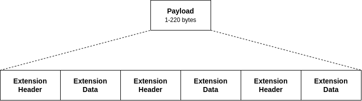

*****************
Extension Packets
*****************

If the NGHam extension flag is set, the Payload contains NGHam extension data. Each NGHam extension packet has a separate header, describing the type and size of the following data. A payload can contain multiple extension packets, each containing information such as position, callsign, timing information, statistics, destination, repeating information and others. Below there is a figure with a diagram illustrating the format of a NGHam Extension packet.

      Fig. Format of a NGHam Extension packet.

.. note::
   Since the extension packets are not fully implemented and documented in the original NGHam implementation, the support for this resource is not complete yet. Some extension packet are already implemented and working, and some are not implemented because of lack of information about it. In the future, a definition of these packets are planned to be done.

Types of Extension Packets
==========================

Next, there is a description of each kind of extension packet provided by the NGHam protocol. All packets share the same structure:

* Type (1 byte), with a unique ID for each type of extension packet.
* Data length (1 byte), with the number of data bytes in the extension packet.
* Data (N bytes), with the data of the extension packet.

Data Packet
-----------

The data extension packet is a packet with generic data (any sequence of bytes). It follows the structure below.

+---------------+--------------+--------------------+
| Field         | Size (bytes) | Content            |
+===============+==============+====================+
| Type          | 1            | 00h                |
+---------------+--------------+--------------------+
| Packet length | 1            | 01h to DAh         |
+---------------+--------------+--------------------+
| Data          | Variable     | Any bytes sequence |
+---------------+--------------+--------------------+

ID Packet
---------

The ID extension packet is a packet with identification data of the transmitter. It follows the structure below.

+---------------+--------------+-----------------+
| Field         | Size (bytes) | Content         |
+===============+==============+=================+
| Type          | 1            | 01h             |
+---------------+--------------+-----------------+
| Packet length | 1            | 09h             |
+---------------+--------------+-----------------+
| Data          | 7            | Callsign        |
|               +--------------+-----------------+
|               | 1            | SSID            |
|               +--------------+-----------------+
|               | 1            | Sequence number |
+---------------+--------------+-----------------+

.. note::
    Always first in a packet, except when resent by another station.

Status Packet
-------------

The status extension packet is a packet statistic and telemetry data. It follows the structure below.

+---------------+--------------+------------------------------------------------------------+
| Field         | Size (bytes) | Content                                                    |
+===============+==============+============================================================+
| Type          | 1            | 02h                                                        |
+---------------+--------------+------------------------------------------------------------+
| Packet length | 1            | 16h                                                        |
+---------------+--------------+------------------------------------------------------------+
| Data          | 2            | Hardware version ID (10b for company, 6b for product)      |
|               +--------------+------------------------------------------------------------+
|               | 2            | Serial number                                              |
|               +--------------+------------------------------------------------------------+
|               | 2            | Software version (4b major, 4b minor, 8b build)            |
|               +--------------+------------------------------------------------------------+
|               | 4            | Uptime in seconds                                          |
|               +--------------+------------------------------------------------------------+
|               | 1            | Input voltage in decivolts (0-25.5)                        |
|               +--------------+------------------------------------------------------------+
|               | 1            | Temperature in Celsius (-128 to 127)                       |
|               +--------------+------------------------------------------------------------+
|               | 1            | Received signal strength (dBm - 200, -200 to 54 (0xFF=N/A) |
|               +--------------+------------------------------------------------------------+
|               | 1            | Noise floor (same as above)                                |
|               +--------------+------------------------------------------------------------+
|               | 2            | Number of packets successfully received                    |
|               +--------------+------------------------------------------------------------+
|               | 2            | Number of packets with corrected errors                    |
|               +--------------+------------------------------------------------------------+
|               | 2            | Number of packets with uncorrectable errors                |
|               +--------------+------------------------------------------------------------+
|               | 2            | Number of packets sent                                     |
+---------------+--------------+------------------------------------------------------------+

Simple Digipeater Packet
------------------------

TODO

Position Packet
---------------

The position extension packet is a packet with position data. It follows the structure below.

+---------------+--------------+-------------------------------------+
| Field         | Size (bytes) | Content                             |
+===============+==============+=====================================+
| Type          | 1            | 04h                                 |
+---------------+--------------+-------------------------------------+
| Packet length | 1            | 11h                                 |
+---------------+--------------+-------------------------------------+
| Data          | 4            | Latitude                            |
|               +--------------+-------------------------------------+
|               | 4            | Longitude                           |
|               +--------------+-------------------------------------+
|               | 4            | Altitude                            |
|               +--------------+-------------------------------------+
|               | 2            | SOG (hundreds of meters per second) |
|               +--------------+-------------------------------------+
|               | 2            | COG (tenths of degrees)             |
|               +--------------+-------------------------------------+
|               | 1            | HDOP (tenths)                       |
+---------------+--------------+-------------------------------------+

Time Information Packet
-----------------------

The time information extension packet is a packet with time data (TOH, or Time Of Hour). It follows the structure below.

+---------------+--------------+---------------------+
| Field         | Size (bytes) | Content             |
+===============+==============+=====================+
| Type          | 1            | 05h                 |
+---------------+--------------+---------------------+
| Packet length | 1            | 05h                 |
+---------------+--------------+---------------------+
| Data          | 4            | TOH in microseconds |
|               +--------------+---------------------+
|               | 1            | TOH validity        |
+---------------+--------------+---------------------+

Destination Packet
------------------

The destination extension packet is a packet with destination data of the packet. It follows the structure below.

+---------------+--------------+------------------+
| Field         | Size (bytes) | Content          |
+===============+==============+==================+
| Type          | 1            | 06h              |
+---------------+--------------+------------------+
| Packet length | 1            | 08h              |
+---------------+--------------+------------------+
| Data          | 7            | Callsign         |
|               +--------------+------------------+
|               | 1            | SSID             |
+---------------+--------------+------------------+

Command Request Packet
----------------------

TODO

Command Reply Packet
--------------------

TODO

Request Packet
--------------

TODO
