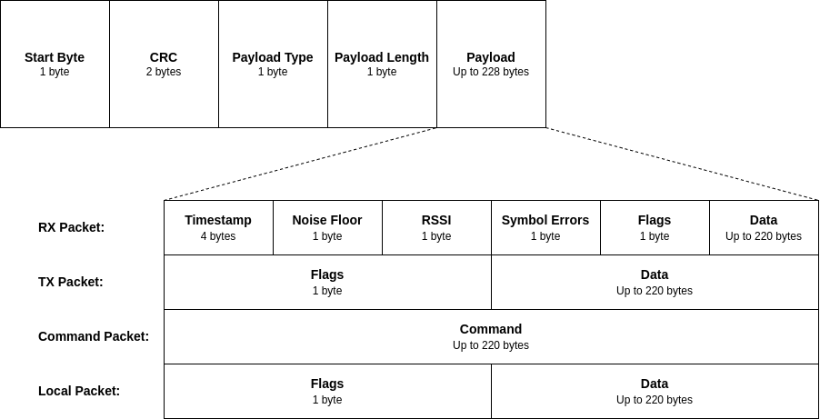

********************
Serial Port Protocol
********************

This section presents the Serial Port Protocol (SPP) of the NGHam [1]_. It is a variation intended to be used over serial communications between radio and computer.

Overview
========

This chapter describes the protocol used to transfer data and commands between the transceiver and the serial port host.

Packet Fields
=============

In the diagram below, the fields of the SPP packets are illustrated.

      Fig. Format of a NGHam SPP packet.

The packet fields are better described in the table below.

+----------------+-----------------+-------------------------------------------------------------+
| **Name**       | **Size (Byte)** | **Notes**                                                   |
+================+=================+=============================================================+
| Star tag       |               1 | Fixed as '$'.                                               |
+----------------+-----------------+-------------------------------------------------------------+
| CRC Size       |               2 | 16-bit CRC-CCITT (start=0xFFFF, polynomial=0x1021 reversed, |
|                |                 | Xorout=0xFFFF). Notice the use of little endian, as         |
|                |                 | everything on this layer and up use little endian. CRC is   |
|                |                 | calculated of everything except start tag and CRC itself.   |
+----------------+-----------------+-------------------------------------------------------------+
| Payload type   |               1 | 0x00=RF receive packet, 0x01=RF transmit packet,            |
|                |                 | 0x02=Local packet, 0x03=Command.                            |
+----------------+-----------------+-------------------------------------------------------------+
| Payload length |               1 | Length of payload field.                                    |
+----------------+-----------------+-------------------------------------------------------------+
| Payload        |               n | This is the actual payload specified by the payload type.   |
+----------------+-----------------+-------------------------------------------------------------+

Next, there is a description of the fields of each SPP type of packet.

RF RX Packet
------------

Data received from RF link (from radio to host). Length from 4 to 223. The table below describes what is put into the payload of the general packet format.

+------------------------------+-----------------+------------------------------------------------------------+
| **Name**                     | **Size (Byte)** | **Notes**                                                  |
+==============================+=================+============================================================+
| Time of hour in microseconds |               4 | Local time of hour timestamp of the incoming packet.       |
|                              |                 | Wraps from 3599999999 (one step before 3600 seconds)       |
|                              |                 | to 0. N/A-value is 0xFFFFFFFF.                             |
+------------------------------+-----------------+------------------------------------------------------------+
| Noise floor                  |               1 | Subtract 200 to get dBm. Eg. 0x50 = -120 dBm. N/A is 0xFF. |
+------------------------------+-----------------+------------------------------------------------------------+
| RSSI                         |               1 | Same as above.                                             |
+------------------------------+-----------------+------------------------------------------------------------+
| Symbol errors                |               1 | Number of corrected Reed Solomon symbols.                  |
+------------------------------+-----------------+------------------------------------------------------------+
| Flags                        |               1 | Bit 0: NGHam extension enabled. If this bit is set, the    |
|                              |                 | data field is a valid NGHam extension packet.              |
+------------------------------+-----------------+------------------------------------------------------------+
| Data                         |             n-8 | BReceived data.                                            |
+------------------------------+-----------------+------------------------------------------------------------+

RF TX Packet
------------

Data to be transmitted on RF link (from host to radio). Length from 1 to 220. The table below describes what is put into the payload of the general packet format.

+----------+-----------------+--------------------------------------+
| **Name** | **Size (Byte)** | **Notes**                            |
+==========+=================+======================================+
| Flags    |               1 | Bit 0: NGHam extension enabled flag. |
+----------+-----------------+--------------------------------------+
| Data     |           n-1 B | Data to be transmitted.              |
+----------+-----------------+--------------------------------------+

Local Packet
------------

Packet generated by the radio (not received over the air, from radio to host). For example a status report. The table below describes what is put into the payload of the general packet format.

+----------+-----------------+--------------------------------------+
| **Name** | **Size (Byte)** | **Notes**                            |
+==========+=================+======================================+
| Flags    |               1 | Bit 0: NGHam extension enabled flag. |
+----------+-----------------+--------------------------------------+
| Data     |           n-1 B | Data to be transmitted.              |
+----------+-----------------+--------------------------------------+

Command (CMD) Packet
--------------------

This type of packet is used to enter commands. On the Owl VHF, this command will do the same as typing into the command-line interpreter, except the commands and replies are not terminated by LF/CR/CRLF. The table below describes what is put into the payload of the general packet format.

+----------+-----------------+----------------------------------------------------------+
| **Name** | **Size (Byte)** | **Notes**                                                |
+==========+=================+==========================================================+
| Command  |             n B | Non-terminated command, as for example "FREQ 144800000”. |
+----------+-----------------+----------------------------------------------------------+

References
==========

.. [1] https://github.com/skagmo/ngham
