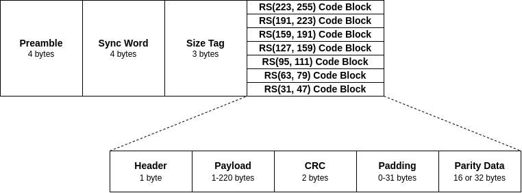

# Summary

The PyNGHam library is a Python version of the original NGHam protocol library written in C by Jon Petter Skagmo (LA3JPA) [@ngham]. The NGHam protocol is an amateur radio protocol developed to be a modern version of the AX.25 protocol, with the main improvement being the addition of a forward error correction (FEC) algorithm, which improves considerably the robustness of a communication link. Nowadays, one of the main uses of this protocol is on small satellite projects (specifically in CubeSats), as the protocol of the radio links between stations on Earth and a satellite. This Python implementation allows easier integration and use of this protocol in computers and embedded devices.

# Statement of need

The NGHam protocol was developed in the context of a CubeSat development at the Norwegian University of Science and Technology (NTNU). After that, it was used by the SpaceLab team in the FloripaSat-1 CubeSat, and it's being used by all satellites of the group so far. A list of known satellites that used or plan to use the NGHam protocol is presented below:

* **FloripaSat-1** [@marcelino2020]
* **GOLDS-UFSC (a.k.a. FloripaSat-2)**
* **Catarina-A1**
* **PION-BR1**
* **Aldebaran-1**
* **NUTS-1**

The top three satellites on the list above, are satellites developed (or in development) by the same research group: the *Space Technology Research Laboratory* (SpaceLab), from *Universidade Federal de Santa Catarina* (Brazil), which was the context where this library was developed.

From the knowledge of the author, there is no Python implementation of the protocol so far. This way, an implementation with a high-level language is useful for developing user applications to communicate with objects in orbit.

This library is already being used in the development of the satellites of the SpaceLab, specifically in the ground station software [@spacelab-decoder] [@spacelab-transmitter], that sends telecommand and receives data to/from the satellites.

# NGHam Protocol

The NGHam protocol is a link protocol partly inspired by AX.25 [@ax25], with the idea to be used in ham radio packet communication, but using an FEC algorithm and a well-defined packet structure.

For the FEC algorithm, the Reed-Solomon code (RS) is used. Figure \ref{fig:ngham-pkt} presents a diagram with the fields of a NGHam packet.

For a GMSK modulation at 9600 bps, a typical preamble sequence would be 0xAAAAAAAA (a simple alternate of ones and zeros).

The size tag field has seven different options, indicating seven different packet sizes, as described below:

----------------------------------------------------------------------------
Size Num.   Tag             Reed-Solomon Config.    Max. Data Size
----------  --------------  ---------------------   ------------------------
1           59, 73, 205     RS(47, 31)              up to 28 bytes of data

2           77, 218, 87     RS(79, 63)              up to 60 bytes of data

3           118, 147, 154   RS(111, 95)             up to 92 bytes of data

4           155, 180, 174   RS(159, 127)            up to 124 bytes of data

5           160, 253, 99    RS(191, 159)            up to 156 bytes of data

6           214, 110, 249   RS(223, 191)            up to 188 bytes of data

7           237, 39, 52     RS(255, 223)            up to 220 bytes of data
----------------------------------------------------------------------------

Table:  NGHam packets sizes.

Following the seven possible packet sizes, after the size tag field, there is the data field with the Reed-Solomon code block, with seven different schemes, one for each size tag. As can be seen in Figure \ref{fig:ngham-pkt}, the used RS configurations are: (47, 31); (79, 63); (111, 95); (159, 127); (191, 159); (223, 191) and (255, 223).

Inside the code block, there are two types of fields: the packet data and the parity data. The parity data is the byte sequence generated by the Reed-Solomon algorithm. The packet is data is the information of the packet, and is divided in four fields: Header, payload, CRC and padding.

## Scrambling

Before transmitting a packet, the RS code block is scrambled by making a byte xor operation with a pre-generated table based on the polynomial $x^{8} + x^{7} + x^{5} + x^{3} + 1$ (defined in the CCSDS 131.0-B-3 standard [@ccsds]).

When the receiver receives a packet, it also performs the same operation to de-scramble the RS code block and gets the original content of the RS part of the packet.

By scrambling the packets, long sequence of ones or zeros are avoided, by guarantying a good bit transition along the whole packet. More information about packet scrambling (or randomization) can be found in [@ccsds] (section 8.3).

## Serial Protocol

Besides the RF transmissions using the NGHam protocol, there is also the possibility to use the protocol in physical serial interfaces with a slightly different packet structure. In the serial protocol, there is no FEC algorithm involved, just a checksum field to indicate if an error occurred or not during the transmission. Both RF and serial protocols can be integrated into a node.

## Extensions

The payload of an NGHam packet can also contain subpackets, called extension packets. Each NGHam extension packet has a separate header, describing the type and size of the following data. A payload can contain multiple extension packets, each containing information such as position, callsign, timing information, statistics, destination, repeating information, and others. The use of the extensions is optional.

# Python Implementation

This Python implementation of the protocol was inspired in part by the structure of the original implementation in C, but with the main difference being the use of an object-oriented language. This way, there is a class for each of the three main possible uses of the protocol: The normal NGHam packets, the serial port packets, and the use of the extensions. All of these three classes are implemented with a similar approach: there are at least two methods: one for encoding a packet, and one for decoding a packet. The encoding and decoding processes generate a list of integers, representing the bytes of an NGHam packet or the payload data.

# Conclusion

The objective of this library is to offer an alternative purely written in Python for the original NGHam library. This way, this can be easily used in simulations, packet decoding and encoding software, telecommunication classes, and so on. Being useful especially for satellite communication and experiments running in space, and in general for the amateur radio community. More information about the PyNGHam library can be found in its Sphinx documentation [@pyngham-doc].

# Acknowledgement

The author would like to thank Jon Petter Skagmo (LA3JPA), the original creator of the protocol, Phil Karn (KA9Q), the developer of the FEC library, and the SpaceLab members for their support and feedback over the last years.

# References
